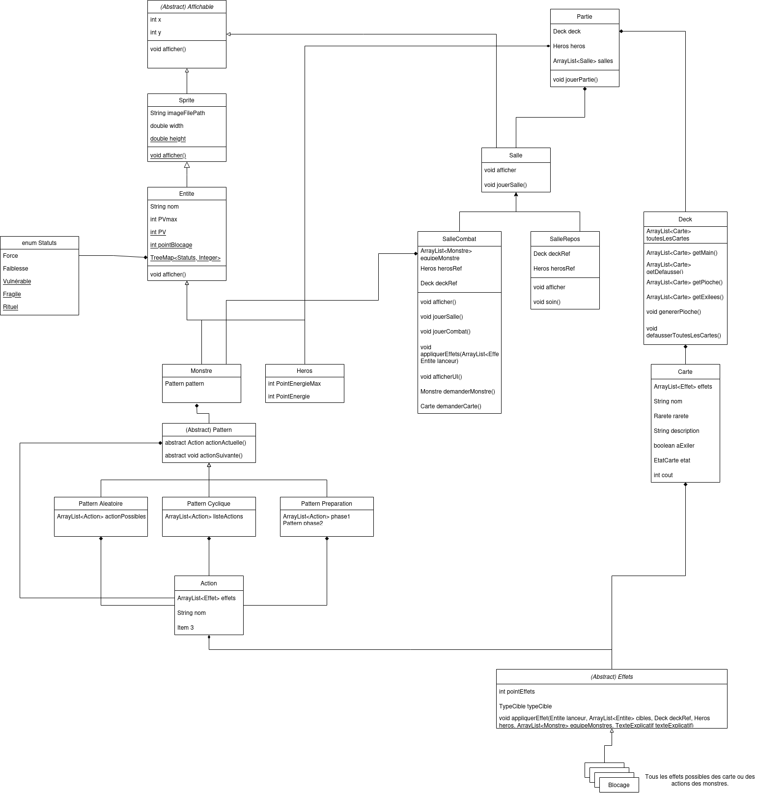
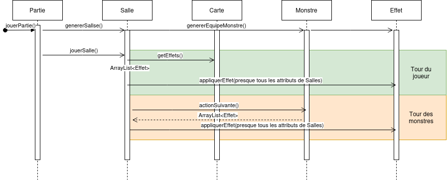

Lien vers le repositorie (qui fait 22.4Mo, soit 12.4Mo de plus que la limite sur Moodle) : https://github.com/ValentinRegnault/Projet-PO/tree/main

# Clone de Slay the Spire

Valentin Regnault\
Nathan Corneloup\
G4 L2 Portail ISTN - année 2023-2024

# Lancement du projet : 
lancer le fichier Projet-PO/src/main/App.java

# Diagramme de classe
Ce diagramme (qui n'est pas exact pour des questions de lisibilité) relate toutes les classes du projet et leurs relations.\

# Diagramme de séquence
Ce diagramme relate le déroulement d'un tour de jeu

La méthode principale est la méthode `jouerPartie()` de la classe Partie. Cette méthode va appeler successivement les méthodes `jouerSalle()` de chaque salle, jusqu'à ce que le joueur meure ou qu'il ait fini toutes les salles.\
Il y a deux types de salles, les salles de Repos (`SalleRepos`) et les salles de Combat (`SalleCombat`). La classe `SalleCombat` contient la logique du combat.\
Lors d'un tour de combat, on demande d'abords au joueur de choisir une carte. La classe SalleCombat fait alors appel à la méthode `trouverProchaineEntree` de la classe `AssociationTouche`. On récupère la carte associée à la touche entrée par le joueur. Cette carte contient des effets, qu'on applique alors à l'ennemi, via la méthode `appliquerEffet` de la classe `Effet`. Cette méthode prend en paramètre des références à de nombreux éléments du jeu, car les effets peuvent avoir des impacts sur presque tout dans le jeu.\
Ensuite, on fait jouer tour à tour les monstres, en récupérant leurs actions, qui contiennent des effets, qu'on applique de la même manière que pour les cartes.\
On recommence ce cycle jusqu'à ce que le joueur ou les ennemis meure.\

# Choix d'implémentation

## Les monstres
Pour l'implémentation des monstres, plusieurs options s'offraient à nous :
- Faire une classe abstraite `Monstre` et faire hériter les monstres de cette classe. Chaque sous-classe implémente alors la méthode `jouerTour()`, qui contient la logique du monstre. Le problème de cette approche est la répétition de code entre les monstres d'une part (les monstres ont les mêmes patterns avec des actions différentes) et entre les monstres et les cartes d’autre part (les monstres et les cartes peuvent occasionner des dégâts par exemple, et la logique est la même). Nous avons donc choisi une autre approche.
- Faire une classe abstraite `Monstre` dont héritent des classes abstraites `MonstreAleatoire`, `MonstreCyclique` et `MonstrePréparation` qui implémente les patterns, et dont héritent les monstres. Cette approche permet de partager le code entre les monstres, mais pas entre les monstres et les cartes.
- Faire une classe `Monstre`, qui a un attribut de type `Pattern`. `Pattern` est une classe abstraite, dont hérite trois classes : `Aleatoire`, `Cyclique` et `Preparation`. Ces patterns implémentent tous la méthode `actionSuivante()` qui retourne une `Action` qui à une liste d'`Effet`. La classe abstraite `Effet` a une méthode `appliquerEffet`. De nombreuses classes (dans le package effets) héritent de la classe `Effet` et implémentent la méthode `appliquerEffet` pour faire des effets génériques. Cette méthode prend en paramètre des références à de nombreux éléments du jeu, car les effets peuvent avoir des impacts sur presque tout dans le jeu.

Nous avons choisi la dernière option, parce qu'elle permet beaucoup plus facilement de partager le code entre les monstres, et entre les monstres et les cartes. Cependant, elle a posé d'autres enjeux, que nous discutons dans la section [Encapsulation](#Encapsulation).\
Cette approche utilise la composition plutôt que l'héritage (plutôt que faire un monstre qui *est* cyclique, on fait un monstre qui *a* un pattern cyclique) ce qui permet une certaine flexibilité. Notamment, le pattern `Preparation` contient en fait un autre pattern, soit `Aleatoire` soit `Cyclique`, ainsi qu'une liste d'action de préparation. Il effectue d'abords ces actions de préparation, puis il agit comme le pattern qu'il contient.

## Sérialisation

Pour simplifier l'ajout de monstre et de cartes, nous avons utilisé la librairie Jackson pour sérialiser les monstres et les cartes en JSON. Le dossier `assets` contient des fichiers JSON qui représentent chaque monstre. Au chargement du jeu, on lit le dossier entier et on crée un monstre pour chaque fichier.\
De cette manière, la création d'un monstre est très déclarative. Au lieu de devoir créer une méthode dont le corps se concentre sur *comment* créer un monstre, on écrit simplement un fichier JSON qui *ce qu'est* le monstre. Jackson se charge ensuite de créer le monstre à partir du fichier JSON.\

## Les effets
Les effets sont des classes qui héritent de la classe abstraite `Effet`. Cette classe a une méthode abstraite `appliquerEffet`, que tous les effets implémentent, et qui constitue la logique de l'effet.\
Différents monstres et cartes peuvent avoir différents types de cible : un effet d'une carte peut agir sur le lanceur de la carte (le héros), un monstre peut agir sur lui-même, ou sur le héros, ou sur ses camarades. Une carte peut agir sur un monstre. Une carte peut agir sur un monstre aléatoire ou sur tous les monstres à la fois.\
Cela est représenté dans la classe Effet par un attribut `typeCible` de type `TypeCible`. `TypeCible` est une énumération de tous les types de cible possible.

## Le Deck

Nous avons choisi de faire une classe Deck, qui a un attribut `toutesLesCartes` qui est une liste de toutes les cartes du jeu. La notion de pioche, défausse, main, et cimetière est alors géré par la classe `Carte` qui a un attribut `etatCarte` de type `EtatCarte`. `EtatCarte` est une énumération de tous les états possible d'une carte (pioche, défausse, main, exilée).\
La classe `Deck` implémente des méthodes pour récupérer la pioche (qui est une liste des cartes dont l'état est pioche), la défausse, la main, et le cimetière. Ces méthodes retournent des versions "immuable" de `List` grâce à la méthode `collections.unmodifiableList()`.\
De cette manière, une carte n'est jamais dans plusieurs tas, et on peut facilement la faire changer de tas (sans devoir gérer une logique complexe de changement de liste). Le défaut de cette approche est que l'utilisateur peut être tenté de faire des opérations sur les listes retournées par les méthodes de `Deck`, car cela semble naturel de vouloir ajouter une carte à sa main en ajoutant une carte dans l'`ArrayList` retournée par `getMain()`. C'est pourquoi nous avons rendu la liste immuable. Dans un cas idéal, nous aurions aimé que java fournisse un type de liste immuable, mais ce n'est pas le cas. Nous aurions alternativement pu en créer un nous-mêmes.

## Encapsulation

Le plus gros défi de ce projet a été de trouver le moyen de *partager le code* entre les classes, tous en respectant l'*encapsulation* et la *flexibilité*.

Nous sommes dès le début partis sur l'idée de faire des monstres composés d'un pattern, lui-même composé d'effets. Au début, la méthode `appliquerEffet` prenait simplement une cible, et lui appliquait l'effet. Cela s'est révélé insuffisant dans le cas de la carte Plaquage, qui inflige des autant de dégâts que le lanceur à de point de blocage. L'effet correspondant, `AppliqueDegatParBlocage`, a besoin d'accéder au lanceur de la carte, pour récupérer son nombre de points de blocage.\
Nous avons donc passé en paramètre de `appliquerEffet` à la fois le lanceur et les cibles. Nous avons alors rencontré un autre problème lorsque nous avons dû implémenter l'effet piocherCarte, utilisé par la carte Manchette par exemple. Cet effet doit accéder au deck pour faire piocher une carte.\
Nous avons alors compris que nous avions un problème de *flexibilité* : dès qu'une carte sort un peu de l'ordinaire, il faut modifier plusieurs classes pour accéder à de nouvelles informations depuis la méthode appliquerEffet. De fait, si nous voulons ajouter un nouveau paramètre à effet, nous devons modifier les classes Salle, Carte, Monstre, Pattern, Action, et Effet, pour faire passer en cascade le nouveau paramètre. Dans le cas du Deck, qui est un attribut de Partie, nous devons le faire passer à Salle, qui le fait passer à Carte, qui le fait passer à Effet. Nous devons aussi le passer depuis Salle à Monstre, qui le fait passer à Pattern, qui le fait passer à Action, qui le fait passer à Effet. C'est trop complexe et trop rigide.\
De plus, cette manière de faire casse l'*encapsulation* : ainsi, de nombreuse classe se retrouve avec un accès au deck, pour que l'effet puisse y avoir accès, alors que ces classes n'en ont pas besoin.\
Nous avons envisagé, quitte à casser l'encapsulation, de mettre l'ensemble des attributs et méthodes de Partie en statique. Ainsi, les effets y auraient accès de manière immédiate, et la flexibilité est garantie. Mais cela annihile totalement l'encapsulation.\
La solution que nous avons adoptée est donc d'exécuter les effets depuis la classe Salle, en passant en paramètre presque tous les attributs de la salle. Les cartes et les monstres retournent leurs effets, et la salle s'occupe d'appeler leurs méthodes `appliquerEffet` avec tous les paramètres. Si on veut ajouter un nouveau paramètre, il suffit de l'ajouter dans l'appel de la méthode `appliquerEffet` dans la classe Salle.\ De cette manière, seuls les effets sont omniscients, et les monstres, les cartes, les patterns, les actions, etc. sont encapsulés.\

# Affichage graphique

L'affichage graphique se fait grâce à la superclasse `Affichable` qui a une méthode abstraite `afficher`. Tout ce qui est affichable doit hériter de cette classe. La salle s'occupe de gérer les appels aux éléments qui doivent être affichés (sa propre méthode affichée appelle celle des monstres, du deck, du héros etc).\
L'interface graphique est aussi gérée par la salle, qui s'occupe de coordonner l'écoute des entrées de l'utilisateur, l'affichage des sélecteurs (les petites lettres qui indiquent quelle touche correspond à quelle carte et à quel monstre), et la logique du jeu.\
